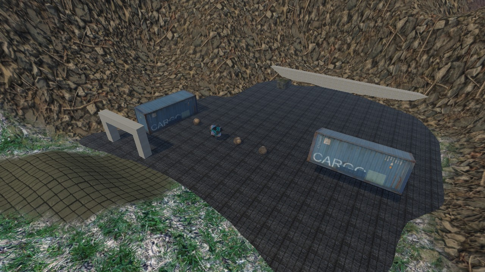
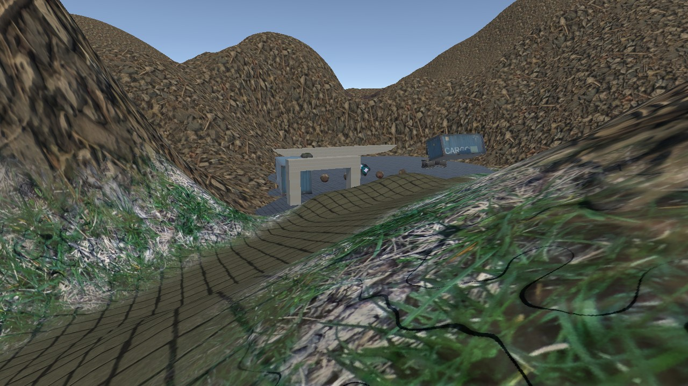

# Проверка подготовки ЛР3 и материалов ЛР4

Дата: 3 октября 2026 года. Unity 6000.3.24f1, Windows x64.

## Автоматические проверки

В отдельной копии проекта на основе локального клона, с наложенными текущими
изменениями, выполнен PlayMode-прогон: **13 passed / 0 failed / 0 skipped**.
ЛР4 была подключена только в проверочной копии. TMP Essentials импортированы
из локального установленного пакета uGUI; новые версии пакетов не устанавливались.

| Набор | Количество | Проверяемое поведение |
| --- | ---: | --- |
| ArenaSurvival.PlayModeTests | 8 | Сцена, Terrain, цели и слои; вертикальный спавн; мышь/выстрел и прыжок; физический урон всем целям; повторное использование и таймер снаряда; отписка смерти; движение/спринт/возврат; проход маршрута через вложенный префаб |
| ArenaSurvival.Lab4.Tests | 5 | Привязка Cinemachine и положение камеры; завершение раунда и отключение игрового ввода; отмена перезапуска и повторное включение; шкала HP и отписка; фактическая перезагрузка сцены с восстановлением целей |

После фиксации изменений дополнительно создан **новый чистый клон коммита
`f86cb4b`** подготовительной ветки. До первого открытия в нём не было `Library`
и `Assets/_Project/Scripts/Lab4`. Unity самостоятельно восстановила пакеты,
импортировала ресурсы и выполнила исходный набор: **8 passed / 0 failed**.
Это проверка именно стартового состояния, которое получают студенты.

Тест маршрута использует виртуальную клавиатуру и настоящий `PlayerMovement` /
`CharacterController`. Положение игрока не телепортируется между контрольными
точками; автоматизация только направляет персонажа к следующей точке.

Проверки ЛР4 тестируют компоненты, а не готовую студенческую сцену. Ручная сборка
Canvas, Animator и назначение Inspector-ссылок остаются частью задания.

## Визуальная проверка

В Unity отдельно отрендерены и просмотрены спавн, маршрут, вход и общий план.
На просмотренных прогретых кадрах нет розовых материалов. Первоначальный кадр
спавна содержал розовый фрагмент, исчезнувший после прогрева рендера. Замена
исходных материалов не потребовалась. Это не доказательство отсутствия любых
визуальных проблем со всех возможных ракурсов.

Композиция проверена через `PrefabUtility.IsAnyPrefabInstanceRoot`: все три
дочерних элемента сохраняют вложенные prefab-связи. В активных объектах основной
сцены не обнаружены Missing Script.

## Воспроизведение

Для базового проекта: Test Runner → PlayMode → ArenaSurvival.PlayModeTests.
Для ЛР4 сначала выполнить подключение из методички, включая TMP Essentials,
затем запустить ArenaSurvival.Lab4.Tests. После изменения камеры адаптировать
ожидания исходных тестов по разделу 15 методички.

`Tools/Lab3Verification.cs` не компилируется в обычном проекте. Для повторения
служебной проверки скопировать его в `Assets/Editor` **отдельного проверочного клона**.
`Lab3Verification.PrepareAndRender` пересоздаёт композицию и сохраняет сцену;
не запускать на несохранённой рабочей сцене преподавателя. Вызывать в batchmode
с графическим устройством, без `-nographics`, с `-executeMethod` и `-quit`.
Изображения и инвентаризация материалов записываются в `Logs/VisualReview`.

`Lab3Verification.ImportTmpEssentials` импортирует локальный пакет и сам завершает
процесс по событию окончания импорта. Для него **не передавать `-quit`**: иначе
Unity завершится до асинхронного импорта. Использовать только в проверочной копии.

## Что не подтверждено автоматизацией

- Полный ручной playtest преподавателем и субъективное удобство управления.
- Финальный вид Canvas/Animator, который студенты создадут по методичке.
- Подтверждённые источники и условия передачи всех сторонних графических пакетов.
- Слияние преподавательской ветки в `master`.
